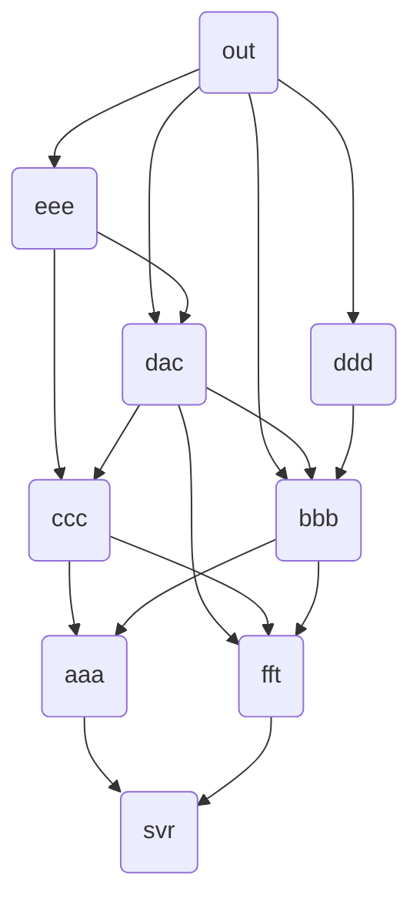

# Solutions to Day 11: Reactor

*For the puzzle description, see [Advent of Code 2025 - Day 11](https://adventofcode.com/2025/day/11).*

Here are my solutions to the puzzles of today. Written chronologically so you can follow both my code and line of thought.

## Part 1

This can get quite a complex fast, giving the size of the graph, but for part 1 I decided to first write a very simple function that traverses through the graph, following all the possible paths recursively. I actually didn't expect it to perform, and only did it to start getting a basic understanding of how this graph and puzzle behaved, but I was surprised to find out it was very quick even this way... only 0.22ms runtime! Then I saw that the `you` node is at the far end of the graph, relatively close to the `out` node, so it does makes sense that this is still possible to 'brute force'. At this speed, and with only a few lines of code really, I decided to leave it at that and move on to the second part.

## Part 2

Then, the second part of this puzzle threw me off quite a bit. I came up with a solution that seemed to work relatively quick, but it didn't work, and it took me very long to figure out why. This turned out to be because the example input is fully linear, but in the actual puzzle input, the connections often cut across depths in the graph. This caused my algorithm to count some paths twice, but only millions of paths into the calculations, which made it very difficult to debug. So I have created an example input myself that represents the complexity a bit better, to test my solution while working on it, and this actually helped me a lot in finding the solution, which was very close to my initial one!

What I do, is the following:
- I keep a counter called `paths` which is initially `0` for all nodes
- I start at the back, at `out`, and set that value of `paths` to `1` (I call this depth `0`)
- then I find all nodes that are connected to `out`, and loop over them, which are `eee`, `dac`, `bbb` and `ddd` (I call this depth `1` as it is the first level down from the last node where I started)
- I then increment each `path` value of that node with the `path` value of the node it is connected with (in this case all `out` for those), effectively setting them all to `1` as well, because their initial value was `0` and `0 + 1 = 1`; and that's correct, because from each of those nodes, there's only one path to `out`
- but here's the caveat: at the following depth, I will ecounter `bbb` again, because it is connected to the top node, but also to one node down, so I will be visiting the same node multiple times at different depths, and this will mess up my path count, as I will effectively count some paths twice if I just keep copying over the path count - to take this into account, I keep track of visited connections, but it's a `List<Node>[]` array so I can store the list of visited connections per depth level, and also, I will keep track of the path count _per level of depth_
- so to fix this, `out` will have `paths` set to `1` at depth `0`, and `eee`, `dac`, `bbb`, and `ddd` will set their path values at depth `1`, but copying over the path counts from depth level `0` from their connections (thus `out`); in other words, in pseudo code: `eee.paths[depth:1] += out.paths[depth:0]`, that's the magic formula! So in C#, that's `node.paths[depth] += connection.paths[depth - 1];`
- then I collect all nodes that connect to the nodes I visited at this depth level (`eee`, `dac`, `bbb`, and `ddd`) which are, in order: `ccc`, `dac`, `ccc`, `bbb`, `aaa`, `fft`, `ddd` - you can see that there are duplicates in this list (because `eee` and `dac` both connect to `ccc`) and that this list contains two nodes that were also present in the previous list, at the previous depth! To filter out duplicates, I simply use a `HashSet<Node>` to store the nodes to check per depth level, and the fact that I encounter the same nodes again at another depth level is taken care of by the array of depths and visited nodes - and you can see that only in a few steps I almost reach the beginning of the graph due to all the 'shortcuts'
- now let's start counting again, `ccc.paths[depth:2] += eee.paths[depth:1] + dac.paths[depth:1]` which is `2`, and then `dac.paths[depth:2] += eee.paths[depth:1] + out.paths[depth:1]`, which is `2` as well. And that's still correct, because there are two ways to visit `out` from `dac`: directly, or via `eee`! And the clever thing here is, that I won't count the route to `out` twice due to the fact that I already counted that while looking at `dac` on depth level `1`, because `out.paths[depth:1]` is actually `0`! That `out` node doesn't occur at depth `1` anymore - so keeping track of the number of paths per depth level both avoids duplicates and multiple levels going forward, but also looking back
- and this continues, as `ccc` will be visited _again_ on `depth` `3` due to `dac` being both on depth `1` and `2`... it is a bit hard to follow and understand maybe, but it really works!

At then end, `svr` will have a `paths` value on multiple `depth` levels, in this small example the first depth is `4` and the last one `5`, but in the real puzzle input the number of depths we arrive back at `svr` spans over quite a bit more columns. The only thing we need to do now is add all those path counts together, and we have the sum of the paths that are possible from `svr` to `out`.

But we're not there yet, because we only want to know the paths that actually go through _both_ `dac` and `fft` (`4` in this case). So I have introduced three more `paths` arrays, which work exactly the same (copying over values from the previous depth and adding them to the current depth for that node for that counter): `visitDac`, `visitFft` and `visitBoth`. Now, what I do when I hit the `dac` node, is copy the current count to the `visitDac` `paths` array, because all paths until now that I count on this node did go through `dac` (I know because I'm there now) and all paths connecting to this node will from now on copy over this value to theirs, all the way to the `svr` node. I do the same for `fft`. And the last trick is that when I hit the `dac` node, I actually cope the _current value of `fft` paths_ to `visitBoth`, because all paths that lead up to this node that went through `fft`, when arriving at `dac`, will consequently go through both, and visa versa. And then, I can also add the sum of all `visitBoth` values on all `depth` levels for the `svr` node, and I have my answer!

There might be quicker ways, but at roughly 59ms I am quite happy with the solution, it doens't use recursion (only calling itself in a loop) and it loops over the input once to create the nodes, ones to create the connections, and then it traverses the graph once, looping over all nodes per node to check it's connections. I don't need memoization, and I visit one node only once per depth level. It's also not a lot of code, though it is a bit hard to grasp, which is why I wrote this elaborate explanation. In the end, a very satisfying puzzle that was both hard and a lot of fun to solve!